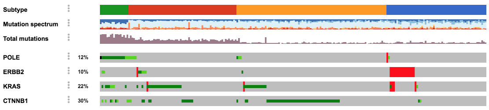



# cBioPortal FAQs

* [General Questions](#general-questions)
  * [What is the cBioPortal for Cancer Genomics?](#what-is-the-cbioportal-for-cancer-genomics)
   * [How do I get started?](#how-do-i-get-started)
  * [What are the terms of use?](#what-are-the-terms-of-use)
  * [What data types are in the portal?](#what-data-types-are-in-the-portal)
  * [Does the portal work on all browsers and operating systems?](#does-the-portal-work-on-all-browsers-and-operating-systems)
  * [How do I cite the cBioPortal?](#how-do-i-cite-the-cbioportal)
  * [Can I use figures from the cBioPortal in my publications or presentations?](#can-i-use-figures-from-the-cbioportal-in-my-publications-or-presentations)
  * [Can I save or bookmark my results in cBioPortal?](#can-i-save-or-bookmark-my-results-in-cbioportal)
  * [Can I use cBioPortal with my own data?](#can-i-use-cbioportal-with-my-own-data)
* [Data Questions](#data-questions)
  * [General Data](#general-data)
    * [Which resources are integrated for variant annotation?](#which-resources-are-integrated-for-variant-annotation)
    * [What version of the human reference genome is being used in cBioPortal?](#what-version-of-the-human-reference-genome-is-being-used-in-cbioportal)
    * [What are the sources of biological network data?](#what-are-the-sources-of-biological-network-data)
    * [Are there any normal tissue samples available through cBioPortal?](#are-there-any-normal-tissue-samples-available-through-cbioportal)
    * [Can I download all data at once?](#can-i-download-all-data-at-once)
    * [How current is the data in the portal?](#how-current-is-data-in-the-portal)
    * [The data or portal user interface today is different than the last time I looked. What happened?](#the-data-or-portal-user-interface-today-is-different-than-the-last-time-I-looked-what-happened) .
    * [How do I access data from AACR Project GENIE?](#how-do-i-access-data-from-aacr-project-genie)
  * [DNA (Mutations, Copy Number &amp; Fusions)](#dna-mutations-copy-number--fusions)
    * [Does the cBioPortal contain synonymous mutation data?](#does-the-cbioportal-contain-synonymous-mutation-data)
    * [What processing or filtering is applied to generate the mutation data?](#what-processing-or-filtering-is-applied-to-generate-the-mutation-data)
    * [What transcripts are used for annotating mutations?](#what-transcripts-are-used-for-annotating-mutations)
    * [How are protein domains in the mutational lollipop diagrams specified?](#how-are-protein-domains-in-the-mutational-lollipop-diagrams-specified)
    * [What is the difference between a “splice site” mutation and a “splice region” mutation?](#what-is-the-difference-between-a-splice-site-mutation-and-a-splice-region-mutation)
    * [Does the portal display mutation of origin annotations?](#does-the-portal-display-mutation-of-origin-annotations)
  * [Clinical Data](#clinical-data)
     * [What kind of clinical data is stored in the portal?](#what-kind-of-clinical-data-is-stored-in-the-portal)
       * [Tumor Type](#tumor-type)
       * [Primary Site](#primary-site)
* [Analysis Questions](#analysis-questions)
  * [How can I query/explore a select subset of samples?](#how-can-i-queryexplore-a-select-subset-of-samples)
      * [Defining samples: Query tab on the homepage](#defining-samples-query-tab-on-the-homepage)
      * [Defining samples: Summary study view](#defining-samples-summary-study-view)
      * [Querying with your defined samples](#querying-with-your-defined-samples)
      * [Selecting for negative samples](#selecting-for-negative-samples)
  * [What is OQL?](#what-is-oql)
  * [Is it possible to determine if a particular mutation is heterozygous or homozygous in a sample? When a sample has 2 mutations in one gene, is it possible to determine whether the mutations are in cis or in trans with each other?](#is-it-possible-to-determine-if-a-particular-mutation-is-heterozygous-or-homozygous-in-a-sample-when-a-sample-has-2-mutations-in-one-gene-is-it-possible-to-determine-whether-the-mutations-are-in-cis-or-in-trans-with-each-other)
* [Results View](#results-view)
  * [OncoPrint](#oncoprint)
    * [What are OncoPrints?](#what-are-oncoprints)
    * [Can I change the order of genes in the OncoPrint?](#can-i-change-the-order-of-genes-in-the-oncoprint)
    * [Can I visualize my own data within an OncoPrint?](#can-i-visualize-my-own-data-within-an-oncoprint)
* [Other pages](#other-pages)
   * [Does the Exclusivity tab calculate its statistics using all samples/alterations or only a specific subset?](#does-the-mutual-exclusivity-tab-calculate-its-statistics-using-all-samplesalterations-or-only-a-specific-subset)
   * [What if I have other questions or comments?](#what-if-i-have-other-questions-or-comments)

# General Questions

### What is the cBioPortal for Cancer Genomics?

The cBioPortal for Cancer Genomics is a resource for the interactive exploration of multidimensional cancer genomics data sets that was developed at Memorial Sloan Kettering Cancer Center. The goal of cBioPortal is to significantly lower the barriers between complex genomic data and cancer researchers by providing rapid, intuitive, and high-quality access to molecular profiles and clinical attributes from large-scale cancer genomics projects, and therefore to empower researchers to translate these rich data sets into biologic insights and clinical applications.

The cBioPortal software is now available under an open source license via [GitHub](https://github.com/cBioPortal/cbioportal). The software is now developed and maintained by a multi-institutional team, consisting of MSK, the Dana Farber Cancer Institute, Princess Margaret Cancer Centre in Toronto, Children's Hospital of Philadelphia, [The Hyve](https://thehyve.nl/) in the Netherlands, and Bilkent University in Ankara, Turkey.

Individual institutions can create their own customizable ‘copy’ or instance of the cBioPortal tool and load their own datasets into the portal. Currently, the UCSF cBioPortal instance contains genomic data generated by the UCSF500 assay.

### How do I get started?

Check out these [tutorial slides](https://www.cbioportal.org/tutorials) to get started or go through the Gao et al [tutorial paper](http://www.ncbi.nlm.nih.gov/pubmed/23550210)).

You can also refer to the [Analysis Questions](#analysis-questions) section in this FAQs manual.

Additionally, we will also be working with the UCSF Library to develop a basic cBioPortal tutorial course (launch date in 2020).

### What are the terms of use?

All users must agree to the terms of use before they have access to the data:

1. I will not attempt to identify or contact individual participants from whom these data were collected by any means without specific approval from the UCSF institutional review board.

2. I will not redistribute or share the UCSF dataset or any elements of this dataset with investigators or other individuals who are not employed by UCSF.

3. When publishing or presenting work using or referencing data from the UCSF dataset, I will first contact Dr. Boris Bastian (boris.bastian@ucsf.edu) and Dr. Alejandro Sweet-Cordero (alejandro.sweet-cordero@ucsf.edu) to ascertain the appropriate attribution to use.

### What data types are in the portal?

The portal supports and stores non-synonymous mutation data, DNA copy-number data, fusion data, test metadata, and de-identified clinical data.

More technical information on these data types are provided in the [DNA (Mutations, Copy Number &amp; Fusions)](#dna-mutations-copy-number--fusions)and [Clinical Data](#clinical-data) sections in this FAQs manual.

cBioPortal does have the ability to support additional data types including mRNA and microRNA expression data, protein-level and phosphoprotein level data (RPPA or mass spectrometry based), and DNA methylation data.

### Does the portal work on all browsers and operating systems?

The team developing and maintaining the cBioPortal software support and test on the following web browsers: Safari, Google Chrome, Firefox 3.0 and above, as well as Internet Explorer 11.0 and above.

### How do I cite the cBioPortal?

Please cite the following portal papers:

* Cerami et al. The cBio Cancer Genomics Portal: An Open Platform for Exploring Multidimensional Cancer Genomics Data. Cancer Discovery. May 2012 2; 401. [PubMed](https://www.ncbi.nlm.nih.gov/pubmed/22588877).

* Gao et al. Integrative analysis of complex cancer genomics and clinical profiles using the cBioPortal. Sci. Signal. 6, pl1 (2013). [PubMed](https://www.ncbi.nlm.nih.gov/pubmed/23550210).

### Can I use figures from the cBioPortal in my publications or presentations?

Yes, you are free to use any of the figures from the portal in your publications or presentations (many are available in SVG or PDF format for easier scaling and editing).

However, as per the terms of use agreement, please email [alejandro.sweet-cordero@ucsf.edu](mailto:alejandro.sweet-cordero@ucsf.edu) and [boris.bastian@ucsf.edu](mailto:boris.bastian@ucsf.edu) if you plan to use any of the data in the portal for publication or presentation purposes.

Additionally, please provide credit to the original developers of the cBioPortal application by citing:

* Cerami et al. The cBio Cancer Genomics Portal: An Open Platform for Exploring Multidimensional Cancer Genomics Data. Cancer Discovery. May 2012 2; 401. [PubMed](https://www.ncbi.nlm.nih.gov/pubmed/22588877).

* Gao et al. Integrative analysis of complex cancer genomics and clinical profiles using the cBioPortal. Sci. Signal. 6, pl1 (2013). [PubMed](https://www.ncbi.nlm.nih.gov/pubmed/23550210).

### Can I save or bookmark my results in cBioPortal?

You can bookmark your query results and share the URL with collaborators. We store all queries via Session IDs, and these are saved indefinitely. Use the bookmark tab to retrieve the full link or generate a short link via the bit.ly link generator.

### Can I use cBioPortal with my own data?

Both the [OncoPrint](https://cbioportal.ucsf.edu/cbioportal/oncoprinter.jsp) and [Lollipop Plot](https://cbioportal.ucsf.edu/cbioportal/mutation_mapper) visualization tools can be used with your own dataset.

If you have a dataset you want to include as a distinct study in the UCSF cBioPortal that can be analyzed using the entire suite of analysis and visualization tools, we encourage you to contact [michelle.turski@ucsf.edu](mailto:michelle.turski@ucsf.edu) with the particulars of your dataset.

# Data Questions

## General Data

### Which resources are integrated for variant annotation?

cBioPortal supports the annotation of variants from several different databases. These databases provide information about the recurrence of, or prior knowledge about, specific amino acid changes.

* For each variant, the number of occurrences of mutations at the same amino acid position present in the COSMIC database are reported.

* Variants are annotated as “hotspots” if the amino acid positions were found to be recurrent linear hotspots, as defined by the Cancer Hotspots method ([cancerhotspots.org](http://www.cancerhotspots.org/)), or three-dimensional hotspots, as defined by 3D Hotspots ([3dhotspots.org](https://www.3dhotspots.org/)).

* Prior knowledge about variants, including clinical actionability information, is provided from three different sources: OncoKB ([oncokb.org](http://oncokb.org/)), CIViC ([civicdb.org](https://civicdb.org/)), as well as My Cancer Genome [mycancergenome.org](https://www.mycancergenome.org/)).

* For OncoKB, exact levels of clinical actionability are displayed in cBioPortal, as defined by [the OncoKB paper](http://ascopubs.org/doi/full/10.1200/PO.17.00011).

* Additionally, for those variants that are reported, we have included the manually-assigned pathogenicity annotations from the report.

* In the OncoPrint view, mutations labeled as either putative driver or unknown significance is derived from OncoKB or Cancer Hotspots.

* A future version of UCSF cBioPortal will include the manually-derived pathogenicity annotations in both the OncoPrint view and the Mutations view.

### What version of the human reference genome is being used in cBioPortal?

cBioPortal currently uses hg19/GRCh37.

### What are the sources of biological network data?

The biological network data were retrieved from [Pathway Commons](http://www.pathwaycommons.org/).

### Are there any normal tissue samples available through cBioPortal?

No, we currently do not store any normal tissue data in our system. Our instance does include germline annotations of variants, though. Please refer to the [Does the portal display mutation of origin annotations?](#does-the-portal-display-mutation-of-origin-annotations)

section in this FAQs manual for more information.

### Can I download all data at once?

You can download the entire cohort, sub-cohorts, or individual patient data on the portal. Additionally, all of the figures in the portal are downloadable.

We do ask if you are downloading data from the portal that you email [michelle.turski@ucsf.edu](mailto:michelle.turski@ucsf.edu) and provide details of the data you are downloading so we can better track usage of the portal.

Please also refer to the following:

* [How do I cite the cBioPortal?](#how-do-i-cite-the-cbioportal)

* [Can I use figures from the cBioPortal in my publications or presentations?](#can-i-use-figures-from-the-cbioportal-in-my-publications-or-presentations)

### How current is the data in the portal?

Refer to the [News](https://cbioportal.ucsf.edu/cbioportal/news) page will summarize new data additions. In general, we will update the portal will additional UCSF500 cases on a monthly basis.

### The data or portal user interface today is different than the last time I looked. What happened?

**The user interface looks different**

The cBioPortal developers occasionally release new version of the software. Descriptions of the items in each release can be found on the GitHub [page](https://github.com/cBioPortal/cbioportal/releases) for cBioPortal.

The UCSF cBioPortal will upgrade to new versions on an approximately monthly basis. The [News](https://cbioportal.ucsf.edu/cbioportal/news) page will summarize any user interface changes that occur between versions of the portal.

**The data looks different**

We will be continuously uploading more UCSF500 cases to the portal so the dataset will expand over time. Additionally, we will be adding more annotations, with an emphasis on clinical data, into the portal as well.

The [News](https://cbioportal.ucsf.edu/cbioportal/news) page will summarize any new data uploads that occur between versions of the portal.

However, if you suspect that there is an error in the current version, please let us know by filling out this [survey](https://redcap.ucsf.edu/surveys/?s=HD8JARCM33).

### How do I access data from AACR Project GENIE?

Data from AACR Project GENIE are provided in a [dedicated instance of cBioPortal](https://www.cbioportal.org/genie/). You can also download GENIE data from the [Synapse Platform](http://synapse.org/genie). Note that you will need to register before accessing the data.

If you have any questions or run into problems accessing the GENIE cBioPortal, please email [michelle.turski@ucsf.edu](mailto:michelle.turski@ucsf.edu).

#### How is the UCSF cBioPortal instance different from the GENIE cBioPortal?

The UCSF cBioPortal currently has more UCSF500 cases than what is available on the GENIE cBioPortal, however the GENIE cBioPortal has more cases in total as it represents sequenced cases from 19 different institutions. It should be noted, however, that most of the institutions are using different panels having both different technical specifications and gene content.

Additionally, germline variants are currently not annotated in the GENIE cBioPortal.

The GENIE synapse platform has a data guide and bed file paired with each release of the portal that describes the panel technical and content specifications for each institution. Navigate to the ‘Files’ tab on the wiki page and then the ‘Data Releases’ folder.

## DNA (Mutations, Copy Number & Fusions)

### Does the cBioPortal contain synonymous mutation data?

No, the cBioPortal does not currently support synonymous mutations. This may change in the future, but there are no plans yet to add this feature by the development teams.

### What processing or filtering is applied to generate the mutation data?

The only processing we do is the standardization of mutation annotation by using [VEP](http://useast.ensembl.org/info/docs/tools/vep/index.html) with the [canonical UniProt transcript](https://github.com/mskcc/vcf2maf/blob/master/data/isoform_overrides_uniprot).

There are two levels of filtering that occurs:

1. Filtering of VCF: filtering is based on such variables as read coverage, population frequency, and known sequencing artifacts of the assay.

2. Filtering of cBioPortal staging files: variants are filtered out with silent, intron, IGR, 3’UTR, 5’UTR, 3’Flank and 5’Flank with exception for promoter mutations of the _TERT_ gene (as called by VEP).

### What transcripts are used for annotating mutations?

Prior to loading a study into cBioPortal, we run all mutation data through a standard pipeline (see above), which re-annotates all mutations to the [canonical UniProt transcript](https://github.com/mskcc/vcf2maf/blob/master/data/isoform_overrides_uniprot).

### How are protein domains in the mutational lollipop diagrams specified?

Protein domain definitions come from [PFAM](http://pfam.xfam.org/).

### What is the difference between a “splice site” mutation and a “splice region” mutation?

A “splice site” mutation occurs in an intron, in a splice acceptor or donor site (2bp into an intron adjacent to the intron/exon junction), defined by [Sequence Ontology](http://www.sequenceontology.org/browser/current_svn/term/SO:0001629).

“Splice region” mutations are mutations that occur near the intron/exon junction, defined by [Sequence Ontology](http://www.sequenceontology.org/browser/current_svn/term/SO:0001630). While synonymous mutations are generally excluded from cBioPortal, these “splice region” synonymous mutations are included due to their potential impact on splicing.

### Does the portal display mutation of origin annotations?

Somatic/germline annotations are derived directly from the VCF. Therefore, any manually adjusted mutation of origin annotations are **not** reflected in the portal.

Cases where the mutation of origin annotations might be incorrect are variants representing clonal hematopoiesis of indeterminate potential (‘CHIP’), cases where contamination of normal sample with tumor-derived samples has occurred, and cases where the germline variant is selectively lost in the tumor sample because of copy number changes/loss of heterozygosity.

## Clinical Data

### What kind of clinical data is stored in the portal?

The portal currently stores de-identified clinical data, such as gender, patient age at the time of tumor sample collection, tumor type and primary site.

We are working on obtaining a variety of additional clinical data elements to our UCSF cBioPortal including tumor grade, overall and disease-free survival data.

If there are specific clinical data you would like to see in the portal, please fill-out our [survey]([https://redcap.ucsf.edu/surveys/?s=HD8JARCM33](https://redcap.ucsf.edu/surveys/?s=HD8JARCM33))!

#### Tumor Type

We use the [OncoTree](http://oncotree.mskcc.org/#/home) ontology for tumor type, which provides a standardized way of classifying and related tumor types. ‘Cancer Type Detailed’ represents the most granular diagnosis for the case given available information, while ‘Cancer Type’ is a higher-level node in the ontology.

#### Primary Site

This is derived directly from the UCSF500 report and actually represents the source location of the biopsy; therefore it might not represent the true primary site of the tumor per se. We are working on obtaining the true primary site for cases in the portal.

This data is currently not standardized. As such the same term might be described differently (e.g. ‘Brain, right frontotemporal lobes’ and ‘Brain, right frontotemporal’ or ‘Kidney, left’, ‘Left Kidney’, and ‘Kidney, left lower pole’).

# Analysis Questions

### How can I query/explore a select subset of samples?

cBioPortal allows you to run a query or explore study view using a user-specified list of samples/patients.

The first step is to define your sample set. There are two pages where you can define your sample set:

#### Defining samples: Query tab on the homepage

Currently you can only select the entire cohort from this page but we are working on creating more disease-specific and other sub-cohorts of the data you can select from this view. Enter in the gene(s) you are interested in analyzing and run the query.

Click over to the “Download” tab. In the table at the top, find the row that starts with “Samples affected”, and either copy or download that list. This is your list of samples that have mutations in your gene(s) of interest. Refer to [Querying with your defined samples](#querying-with-your-defined-samples) for next steps.

#### Defining samples: Summary study view

After you select the entire cohort from the Query tab on the homepage, click on the ‘View summary’ button that will take you to the study summary page. From here you can select specific cancer types and/or genes by selecting the checkbox.

- Selecting specific cancer types will automatically filter the data and the various charts will updated.

- Checking specific genes will not automatically filter the data but instead you’ll need to click the ‘Select Samples’ button to the bottom right of the Gene box.

You can also subset data using the bar graphs (e.g. Age) by placing cursor inside graph near the left-most bar you want in your dataset and ‘highlighting’ across to the right-most bar you want in your dataset.

**Important: the Query genes search bar in this view is currently broken/known issue in this version of cBioPortal and will be fixed in our next upgrade.**

From this view you can also click on the Select cases by IDs button. Within the box that pops-up, click on ‘Use selected samples/patients’; note the default setting is by sample ID but you can change this to patient ID by selecting the other radio button at bottom of box.

Once you click on ‘Use selected samples/patients’, the IDs of the cohort you defined using the study summary page will be displayed. Copy these IDs; these are your list of desired samples. Refer to [Querying with your defined samples](#querying-with-your-defined-samples) for next steps.

#### Querying with your defined samples

Return to the Query tab on the Homepage (click on the cBioPortal logo at very top left corner).

Next, select “User-defined Case List” in the **Select Patient/Case Set:** dropdown. Paste the IDs in the box below the selection bar (note again default here is by sample ID so if you used patient ID select that radio button).

Finally, you can then also layer on specific or additional gene queries by entering your desired list of genes in the **Enter Genes:** section immediately below.

#### Selecting for Negative Samples

On the Query tab of the homepage, enter the gene(s) for which you are looking for samples with no detected mutations in gene(s). Run the query. Click over to the “Download” tab. Look at the table at the top and find the row that starts with “Sample matrix”. Copy or download this data and open it in Excel.

You will see a two column table that indicates whether a given sample is altered or not, indicated by 0 or 1. Sort by the second column and then copy all the sample IDs from the first column that have a 0 in the second column. This is your list of samples that do not have mutations in your desired gene(s).

With a sample list in hand, you can now either run a query in just the selected samples (select) or explore this set of patients in study view (click “Select cases by IDs” and then create a Virtual Study restricted to just those samples).

### What is OQL?

For more information about OQL, see the [specification page](https://cbioportal.ucsf.edu/cbioportal/oql) or view the [tutorial slides](https://www.cbioportal.org/tutorials#oql).

### Is it possible to determine if a particular mutation is heterozygous or homozygous in a sample? When a sample has 2 mutations in one gene, is it possible to determine whether the mutations are in cis or in trans with each other?

There is currently no way to definitively determine whether a mutation is heterozygous/homozygous or in cis/trans with another mutation. However, you can try to infer the status of mutations by noting the copy number status of the gene and the variant allele frequency of the mutation(s) of interest relative to other mutations in the same sample. The cBioPortal patient/sample view can help you accomplish this.

# Results View

## OncoPrint

### What are OncoPrints?

OncoPrints are compact means of visualizing distinct genomic alterations, including somatic mutations, copy number alterations, and mRNA expression changes across a set of cases. They are extremely useful for visualizing gene set and pathway alterations across a set of cases, and for visually identifying trends, such as trends in mutual exclusivity or co-occurrence between gene pairs within a gene set. Individual genes are represented as rows, and individual cases or patients are represented as columns.

### Can I change the order of genes in the OncoPrint?

By default, the order of genes in the OncoPrint will be the same as in your query. You can change the order by (a) clicking on the gene name and dragging it up/down or (b) clicking on the three vertical dots next to the gene name to move the gene up/down.

### Can I visualize my own data within an OncoPrint?

Yes, check out the OncoPrinter tool on our [Visualize Your Data page](https://www.cbioportal.org/tools.jsp).

## Other pages

### Does the Mutual Exclusivity tab calculate its statistics using all samples/alterations or only a specific subset?

The calculations on the Mutual Exclusivity tab are performed using all samples included in the query. A sample is defined as altered or unaltered for each gene based on the [OQL](https://www.cbioportal.org/onco_query_lang_desc.jsp) utilized in the query - by default, this will be non-synonymous mutations, fusions, amplifications and deep deletions.

# What if I have other questions or comments?

Please contact [michelle.turski@ucsf.edu](mailto:michelle.turski@ucsf.edu).

You can also communicate with us via [survey](https://redcap.ucsf.edu/surveys/?s=HD8JARCM33) be it reporting a problem or with a suggestion!
